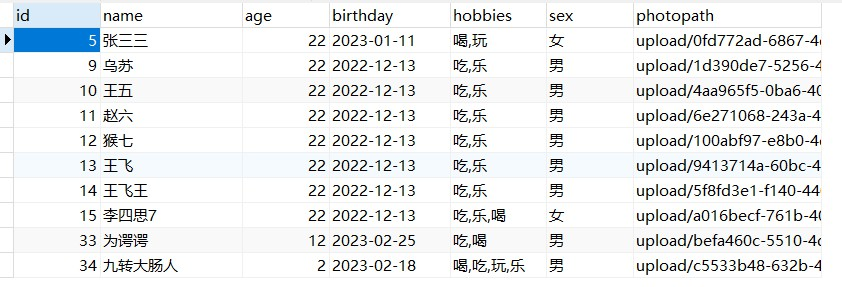

# text_日期_图片_单复选框相关增删改查

#### 介绍
文本，日期，单复选框，文件相关数据库的增删改查

#### 软件架构
软件架构说明

#### 安装教程

### vue-exercise
1.  npm install
2.  npm i axios
3.  npm i vue-router
4.  npm i emelent-plus
5.  npm i vuex
### service
1.  使用ssm架构
#### 使用说明

### vue-exercise
1.  axios: 1.3.2
2.  element-plus: 2.2.29
3.  vue: 3.2.13
4.  vue-router: 4.1.6
5.  vuex": 4.1.0"
### service
1.  tomcat: 9.0.69
2.  spring全家桶: 5.3.25

#### 特技

1.  简单路由守卫
2.  element组件的文件上传
3.  常规数据的增删改查，能够重复应用大部分场景
4.  使用vuex实现状态和行为的重复利用
